* Table of Contents
    - [Introduction](#introduction)
    - [Quick Start](#quick-start)
    - [Application Layout](#application-layout)
    - [Notes about the command format](#notes-about-the-command-format)
    - [Common Input Fields](#common-input-fields)
    - [Features](#features)
        - [Add a flashcard](#add-a-flashcard--add): `add`
        - [Clear all flashcards](#clear-all-flashcards--clear): `clear`
        - [Delete a flashcard](#delete-a-flashcard---delete): `delete`
        - [Edit a flashcard](#edit-a-flashcard---edit): `edit`
        - [Filter for flashcards](#filter-for-flashcards---filter): `filter`
        - [Favourite a flashcard](#favourite-a-flashcard---fav) : `fav`
        - [Unfavourite a flashcard](#unfavourite-a-flashcard---unfav): `unfav`
        - [Find flashcards](#find-flashcards--find): `find`
        - [View help](#view-help--help): `help`
        - [List all flashcards](#list-all-flashcards--list): `list`
        - [Review flashcards](#review-flashcards-review) : `review`
        - [Quiz flashcards](#quiz-flashcards-quiz): `quiz`
        - [Sort all flashcards](#sort-all-flashcards--sort): `sort`
        - [View a flashcard](#view-a-flashcard---view): `view`
        - [View the statistics of a flashcard](#view-the-statistics-of-flashcard--stats): `stats`
        - [Exit the application](#exit-the-application--exit): `exit`
        - [Saving the data](#saving-the-data)
    - [FAQ](#faq)
    - [Command Summary](#command-summary)
    - [Appendix](#appendix)
        - [Finding file path for Diagram field](#finding-file-path-for-diagram-field)
        - [Contributions](#contributions)
        - [Website Link](#website-link)
        

--------------------------------------------------------------------------------------------------------------------

## Introduction

#### Welcome to SWEe! (Software Engineering Everyday!) 😊

Thank you for downloading our application. We look forward to your continuous support and appreciate your feedback to help us improve our application. 

#### What is SWEe!?

SWEe! is a desktop application with a command line interface (CLI) for CS2103 students to manage their learning progress through flashcards. With a CLI, you will be able to perform tasks and navigate to different functionalities of the application more quickly,  allowing you to save precious time for other tasks.

#### SWEe! is perfect for:

* Organising key learning points from the textbook in CS2103 website  in a single platform
* Testing your knowledge of the content taught with the help of SWEe!’s quiz mode
* Tracking your progress and monitor which topics you are weak in using SWEe!’s statistics functionality

#### So, is SWEe! for you?

* Are you a busy CS2103 student who needs more time to focus on other modules such as CS2100 or CS2101?
* Do you get frustrated navigating the CS2103 website?
* Do you want to score well in your examinations?

I’m sure you want to score in your examination 😊 so please proceed on to this user guide to discover the formula for scoring well in your exam. 

## Quick Start

1. Grab your CS2103 notes before we get started.

1. Ensure you have Java 11 or above installed in your Computer. But how? Well, follow the steps below to check your Java version. 
   
   Step 1: Open your terminal. Type in `java --version` and press Enter.

   Step 2: You will now be able to check the Java version installed in your Computer!

   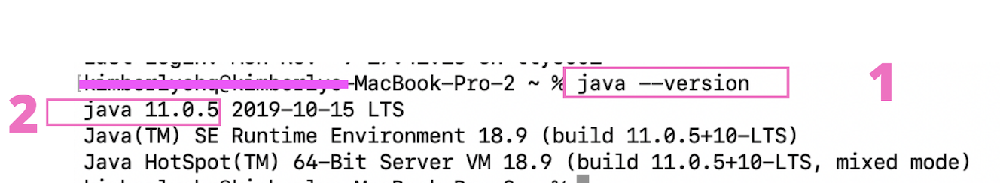

1. Download the latest `swee.jar` from [here](https://github.com/AY2021S1-CS2103T-T17-2/tp/releases). 

    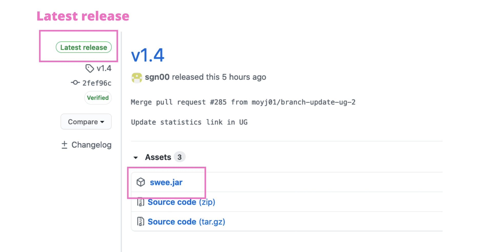

1. Copy the file to the folder you want to use as the _home folder_ for SWEe!.  

    

    
1. Double-click the file to start the app. The GUI similar to the image below should appear in a few seconds. Note how the app contains some sample data. 

    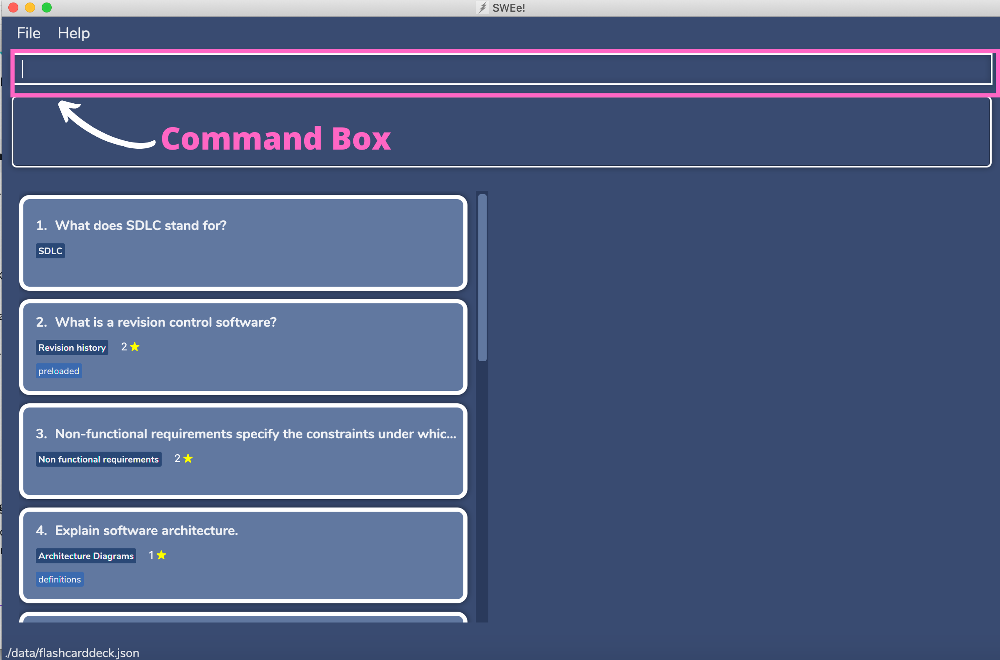

1. At the top of the screen, type the command in the command box and press Enter on your keyboard to execute it. eg. typing `help` and pressing Enter will open the help window.

1. Refer to the [Features](#features) below for details of each command.

## Application Layout

Before we begin, here is how the interface of our application looks like.

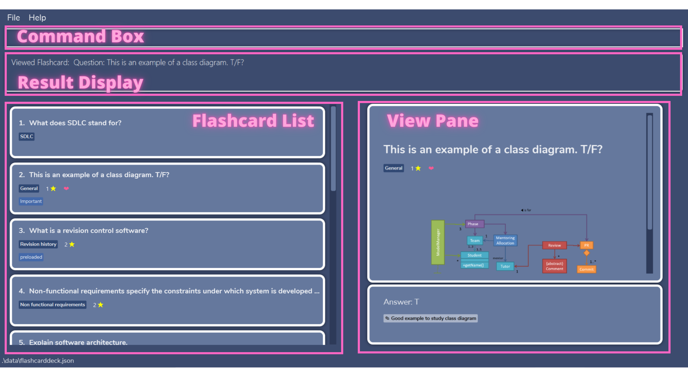

* Command Box: Command box is where you will input and execute commands
* Flashcard List: This is where your precious flashcards will be stored and displayed!
* Result Display: Every time a command is executed in the command box, result display will update to show either a success or error message
* View Pane: This is an area to view the complete details of your flashcard!

Here is an instance on how a flashcard looks like.

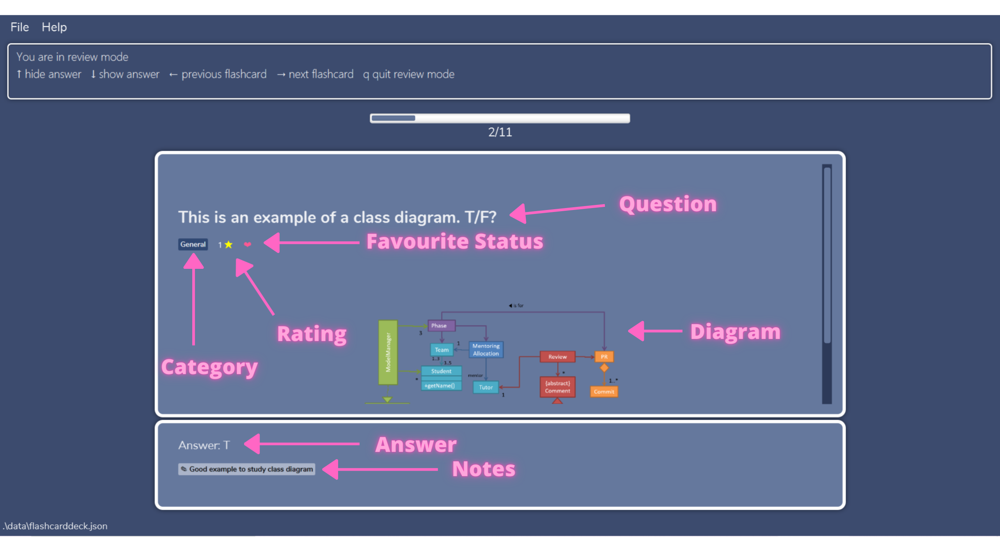

Some terms to take note of:
* Category: Category allows you to group your flashcards according to your preferences.
* Diagram: Diagram is just an image that you can add. It will be together with the question of the flashcard.
* Favourite: Favourite allows you to mark out flashcards that are important to you.
* Notes: Extra pointers that you would like to note down can be stored here. It will be together with the answer of the flashcard.
* Rating: Rating states the importance of the flashcard, from 1 to 5. This star rating is intended to follow the [CS2103 website](https://nus-cs2103-ay2021s1.github.io/website/admin/moduleExpectations.html). 
* Tag: Tags can be added to uniquely identify the flashcard (just like Twitter! 😊).

## Notes about the command format
Feeling a little overwhelmed by the command format we use throughout the user guide? Fear not, as this section will guide you through the various command formats and notations we use throughout the user guide!

Format/Notation | Meaning
-----------|-----------------------
`QUESTION` | Words in uppercase are parameters that you should supply.   eg. in `add q/QUESTION`, `QUESTION` is a parameter which can be used as `add q/What is my name?`
`q/QUESTION` | The letter and slash before the parameter is the prefix. You should use this to separate the current parameter from other parameters.
`success` | Words in lowercase are to be specified exactly, meaning word for word. 
`<success|quiz>` | Items in angle brackets are either/or options. Each option is delineated by a `|`.   eg. `<success|quiz>` can be used as `success` or `quiz` but not both
`[c/CATEGORY]` | Items in square brackets are optional. You can choose whether you want to specify them.   eg. `q/QUESTION [c/CATEGORY]` can be used as `q/What is my name? c/Name` or `q/What is my name?`
`[t/TAG]...` | Items with ellipsis after them can be used either multiple or zero times   eg. `t/TAG` can be used 0 times or as `t/friend`, `t/friend t/family`, etc

:bulb: **Tip:** Parameters can be specified in any order. If the command specifies `q/QUESTION a/ANSWER`, you can specify it as `a/ANSWER q/QUESTION` as well.

 

## Common Input Fields

Many of our commands use the same input fields. This section will teach you what each of them means and how to specify them.
If you are reading this guide for the first time, you can skip to [Features](#features) first. You can refer back to this table at any time!

 

Input Field | What is it & How to specify
-----------|-----------------------
`q/QUESTION`    | Question on the flashcard. `QUESTION` has no character restrictions so you can input anything you like.
`a/ANSWER`      | Answer on the flashcard. `ANSWER` has no character restrictions so you can input anything you like.
`c/CATEGORY`    | Category of the flashcard. `CATEGORY` must be alphanumeric and can be multiple words.
`r/RATING`      | Star rating of the flashcard. `RATING` must be a number between 1 and 5 inclusive.
`d/DIAGRAM`     | Diagram (image) of the flashcard. `DIAGRAM` must be a valid path to a file.  eg. It can be a full file path such as `C:/users/tom/Desktop/image/diagram.png`  eg. It can be a relative file path (relative to swee.jar) such as `images/image.jpg` Only supports the following image file types: jpg, png, jpeg, bmp
`n/NOTE`        | Notes on the flashcard. `NOTE` has no character limit or restrictions so you can input anything you like.
`t/TAG`         | These are tags of the flashcard. A flashcard can have more than one tag. `TAG` must be alphanumeric and must be a single word.
`INDEX`         | `INDEX` refers to the index number shown in the displayed flashcard list. Every visible flashcard on the display list has an `INDEX`. `INDEX` is always a positive integer greater than 0. eg. 1, 2, 3, …
`KEYWORD`       | `KEYWORD` can be alphanumeric or punctuations. `KEYWORD` should not contain spaces.

## Features

### Add a flashcard : `add`

Now let's get started. The first thing you would do in SWEe! is to, of course, add flashcards!

Format: `add q/QUESTION a/ANSWER [c/CATEGORY] [r/RATING] [n/NOTE] [d/DIAGRAM] [t/TAG]...`

* Remember that the `QUESTION` and `ANSWER` fields are compulsory while adding a flashcard! The rest are optional.
* After a new flashcard is added, the flashcard list will update to include the new flashcard.
* If you are having troubles understanding the fields, feel free to refer to [common input fields](#common-input-fields) on what the different fields are and how to specify them.
* To understand how to add diagrams using relative file paths, refer to this [short tutorial](#finding-file-path-for-diagram-field).

:bulb: **Tip:**  You can always add in the remaining fields subsequently using our [edit command](#edit-a-flashcard---edit)!

 

:memo: **Note**: If the category is not specified, the flashcard  will be assigned to the <b>General</b> category by default.

Examples:
* `add q/What does OOP stand for? a/Object Oriented Programming` adds a flashcard with only its compulsory fields, a question and an answer.
* `add q/What does OOP stand for? a/Object Oriented Programming r/3 t/cool` adds a flashcard containing a question, an answer, a rating and a tag.
* `add q/What does OOP stand for? a/Object Oriented Programming d/images/diagram.png` adds a flashcard containing a question, an answer and a diagram
by specifying its file path.

**Steps for adding a flashcard**:

**Step 1**: In this case, we will use one of the add commands above as an example.
To add a flashcard, type the command `add q/What does OOP stand for? a/Object Oriented Programming r/3 t/cool` and press Enter.

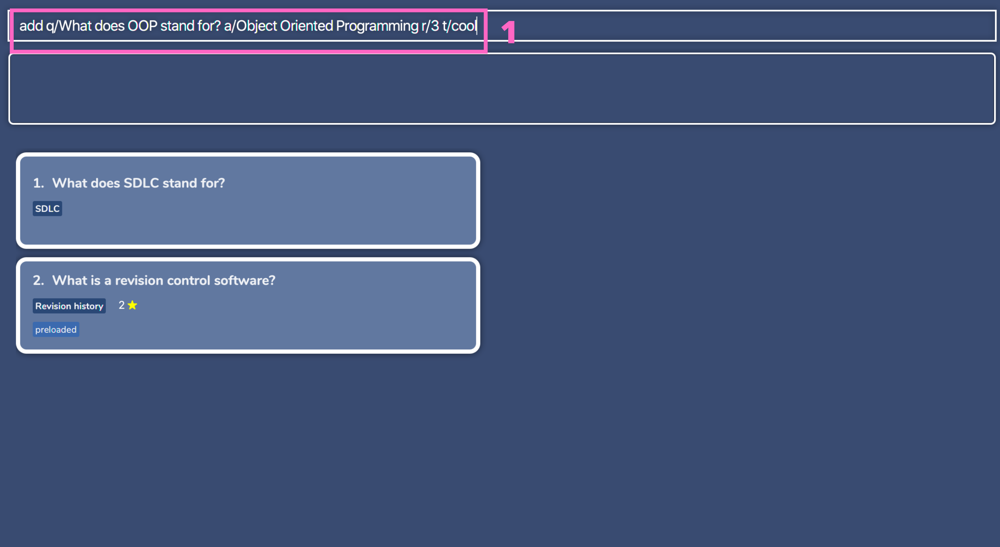

**Step 2**: Success! The result display will display a message telling you that the flashcard is added to the flashcard list.

**Step 3**: The flashcard list will update to show the newly added flashcard.

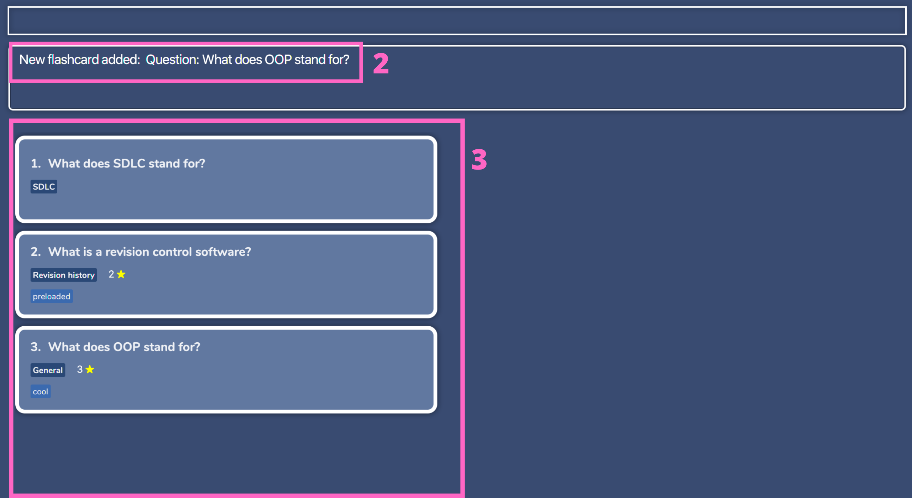

### Clear all flashcards : `clear` 

Want to delete all flashcards at one go? Clear command clears all flashcard data from the program.

Format: `clear`

**Steps for clearing all flashcards**:

**Step 1**: Type `clear` into the command box and press Enter.

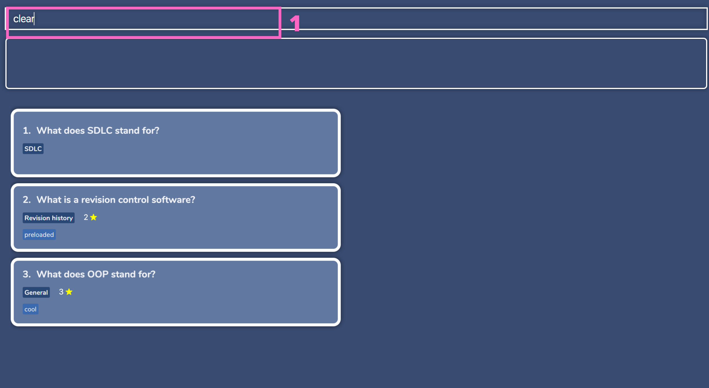

**Step 2**: The result display will display a message telling you that all flashcards have been cleared.

**Step 3**: The flashcard list will be emptied.

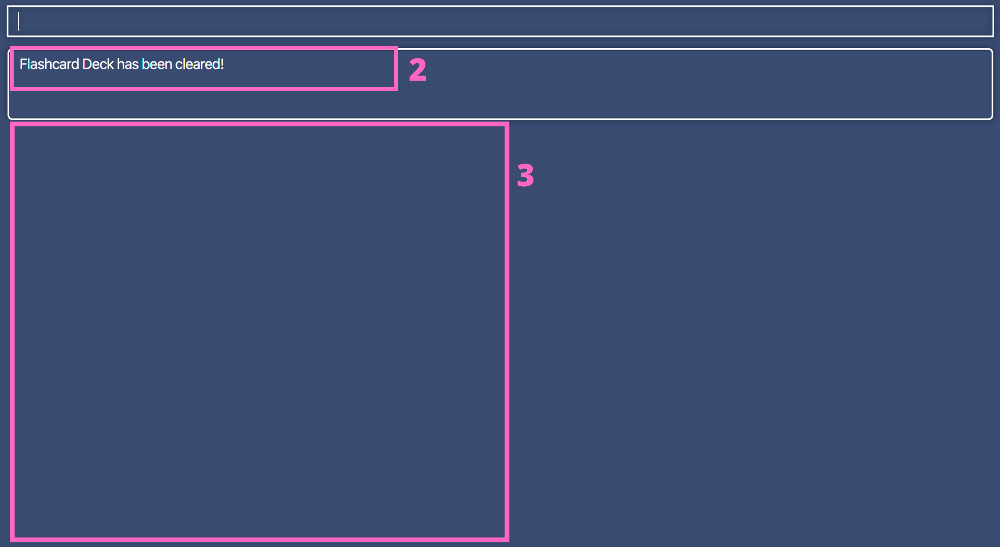

### Delete a flashcard  : `delete`

Realised that a flashcard is now useless or irrelevant? You can simply remove it from your flashcard list using our delete command!

Format: `delete INDEX`

Example: `delete 3` deletes the 3rd flashcard in the flashcard list.

**Steps for deleting a flashcard**:

**Step 1**: Locate the flashcard you want to delete. In this example, we want to delete the 3rd flashcard from the list. Type `delete 3` into the command box and press Enter.

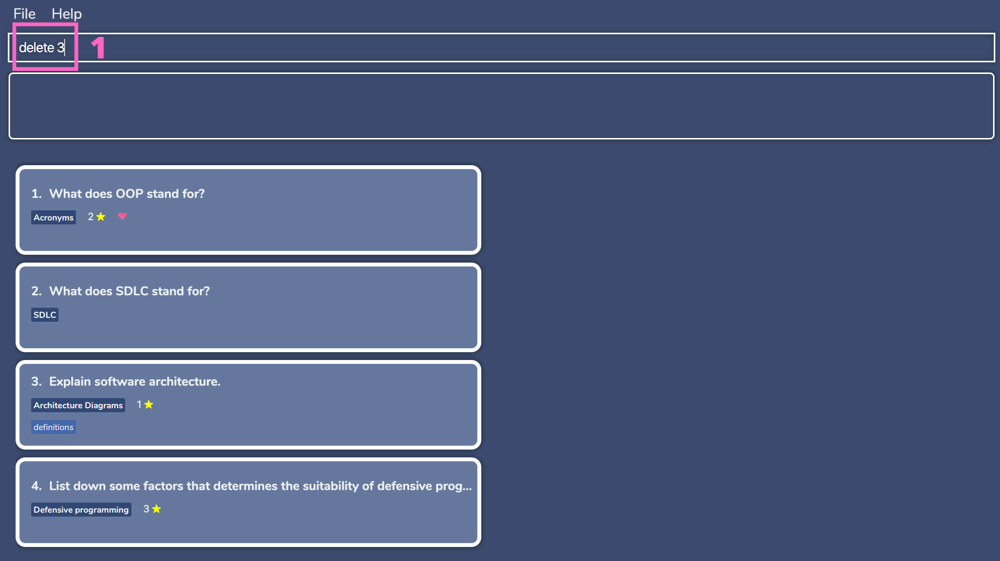

**Step 2**: The result display will display a message telling you that the flashcard has been deleted.

**Step 3**: The flashcard list will be updated after deleting the flashcard.

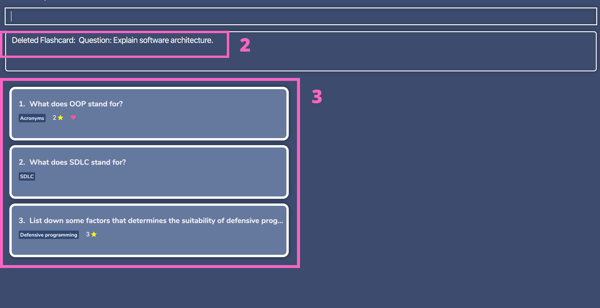

### Edit a flashcard  : `edit`

Yes, we all make mistakes (and typos). Realised that you have a typo in your flashcard? Fret not, you can edit your flashcard details in SWEe! by specifying the fields you want to edit!

Format: `edit INDEX [q/QUESTION] [a/ANSWER] [c/CATEGORY] [n/NOTE] [r/RATING] [d/DIAGRAM] [t/TAG]...`

* Refer to [common input fields](#common-input-fields) on what the different fields are and how to specify them.
* A minimum of one field has to be given.
* To understand how to edit diagrams using relative file paths, refer to this [short tutorial](#finding-file-path-for-diagram-field).

Examples:

* `edit 3 q/What does OOP stand for? c/Acronyms` edits the 1st flashcard’s question and category to be "What does OOP stand for?" and "Acronyms" respectively.
* `edit 3 a/Object Oriented Programming t/OOP` edits the 3rd flashcard’s answer to "Object Oriented Programming" and tag to "OOP".
* `edit 3 n/Important question!` edits the 3rd flashcard’s notes.

**Steps for editing a flashcard**:

**Step 1**: Locate the flashcard you wish to edit. In this example, we want to edit the first flashcard's question and category to "What does OOP stand for?" and "Acronyms" respectively. Type `edit 1 q/What does OOP stand for? c/Acronyms` into the command box and press Enter.

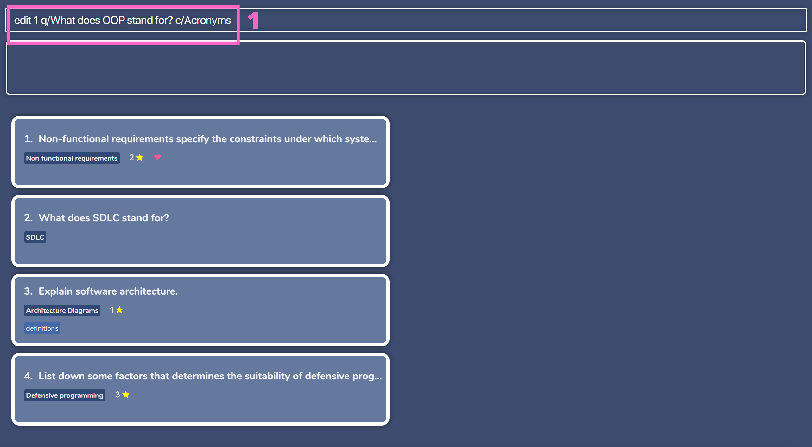

**Step 2**: The result display will show a message that the flashcard has been edited successfully.

**Step 3**: The flashcard list will show the updated details of the flashcard after the edit.

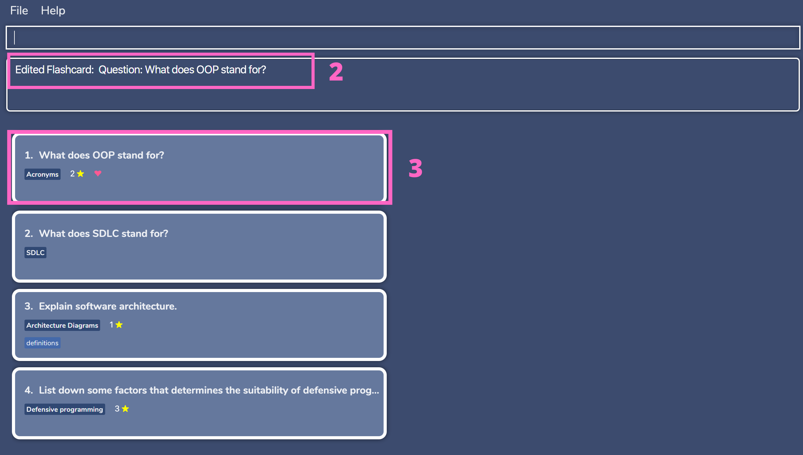

### Filter for flashcards  : `filter`

Want to look at flashcards belonging to a certain category? Or look at flashcards with a rating of 5?
Filter command allows you to filter for specified flashcards based on your field inputs. 

Format: `filter [c/CATEGORY] [r/RATING] [f/<yes|no>] [t/TAG]...`

* Filters for specified flashcards based on category, rating, favourite status or tags.
* Specifying `f/yes` filters for favourited flashcards while `f/no` filters for unfavourited flashcards.
* Supports filtering of one or more different fields. For example:
    - `filter c/SDLC r/5` will filter out flashcards belonging to the SDLC category with a rating of 5.
* Although all fields are optional, a minimum of one field has to be given.
* If you are having troubles understanding the fields, feel free to refer to [common input fields](#common-input-fields) on what the different fields are and how to specify them.

:memo: **Note**: <code>filter r/</code> will filter for all unrated flashcards.

:bulb: **Tip:** Want to list all your flashcards after using `filter`? Use the [list](#list-all-flashcards--list) command.

 

Examples:
*  `filter c/SDLC` filters and lists all flashcards belonging to the SDLC category.
*  `filter t/examinable t/study` filters and lists all flashcards that have both an “examinable” tag and a “study” tag.
*  `filter r/3 f/yes` filters and lists all favourited flashcards that have a rating of 3.

**Steps for filtering for a flashcard based on category and tag**:

**Step 1**: Suppose you want to filter for a flashcard which has a Trivial category and contains the preloaded tag. Type the command `filter c/Trivial t/preloaded` and press Enter.

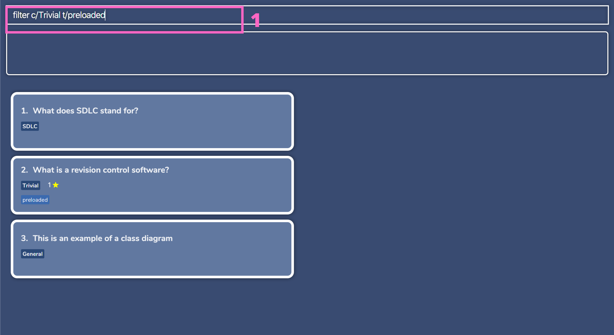

**Step 2**: The result display will show the number of flashcards listed after applying the filter.

**Step 3**: The flashcard list will show the updated list of flashcards belonging to the Trivial category with a "preloaded" tag.

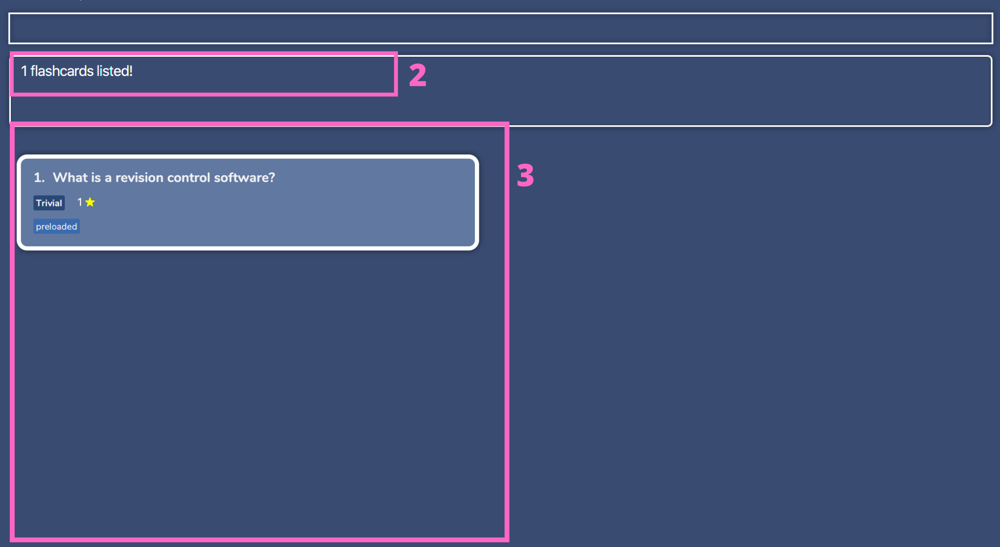

### Favourite a flashcard  : `fav`

Have you ever felt that some flashcards seem particularly important to you and want to flag them out? We understand your need! Simply bookmark those flashcards using our fav command! 

Format: `fav INDEX`

Examples: 
* `fav 2` favourites the 2nd flashcard in the displayed flashcard list.

:bulb: **Tip:** Want to see all the flashcards that are favourited? This is where our [filter](#filter-for-flashcards---filter) command comes into play! Type in `filter f/yes` to see all the flashcards that are favourited!

 

**Steps for favouriting a flashcard**: 

**Step 1**: Identify the flashcard you want to favourite! In this example, we want to favourite the 1st flashcard in the list. Type in `fav 1` and press Enter. 

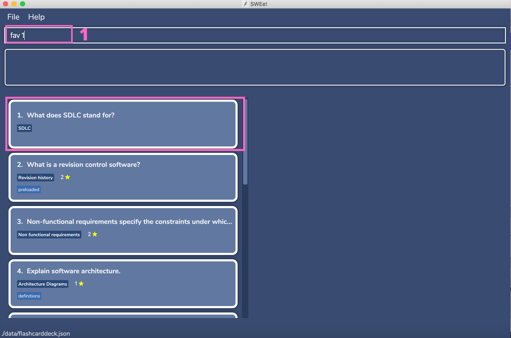

**Step 2**: The result display will display a message to let you know that the flashcard has been favourited!

**Step 3**: Check out that heart icon in the flashcard you have favourited!

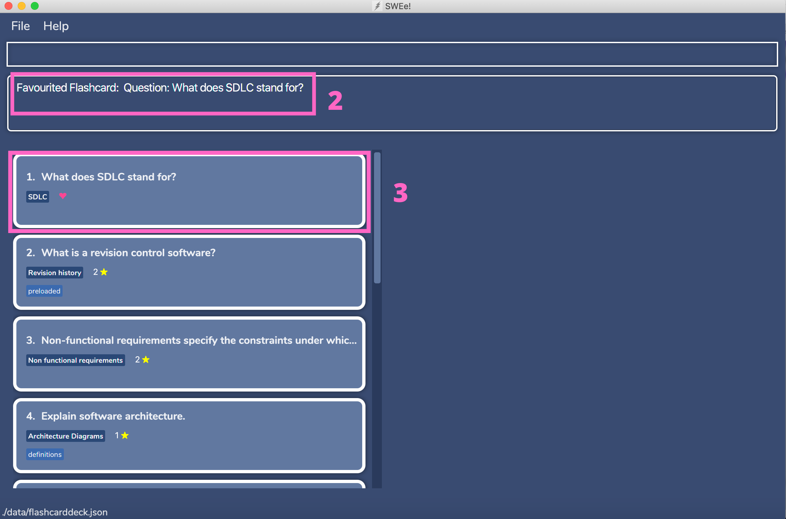

### Unfavourite a flashcard  : `unfav`

Oh no! Accidentally favourited the wrong flashcard? Or did you have a change in heart and decided one of the flashcards is no longer your favourite? Simply unfavourite the flashcard using our unfav command!

Format: `unfav INDEX`

Examples: 
* `unfav 2` unfavourites the 2nd flashcard in the displayed flashcard list.

:bulb: **Tip:** Want to see all the flashcards that are not favourited? This is where our [filter](#filter-for-flashcards---filter) command comes into play! Type in `filter f/no` to see all the flashcards that are not favourited!

 

**Steps for unfavouriting a flashcard**: 

**Step 1**: Identify the flashcard you want to unfavourite! In this example, we want to unfavourite the 1st flashcard in the list. Type in `unfav 1` and press Enter. 

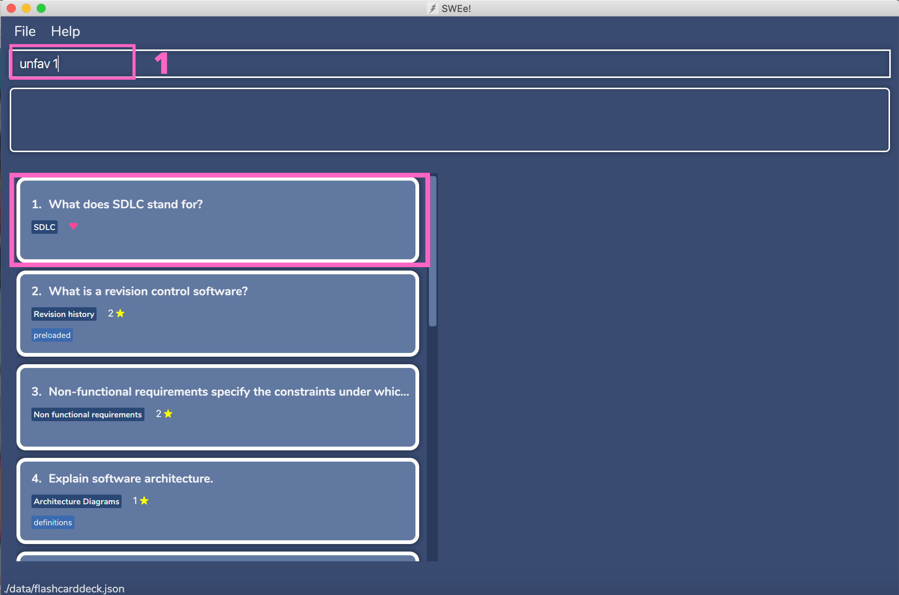

**Step 2**: The result display will display a message to let you know that the flashcard has been unfavourited!

**Step 3**: The heart icon will no longer be visible on the flashcard.

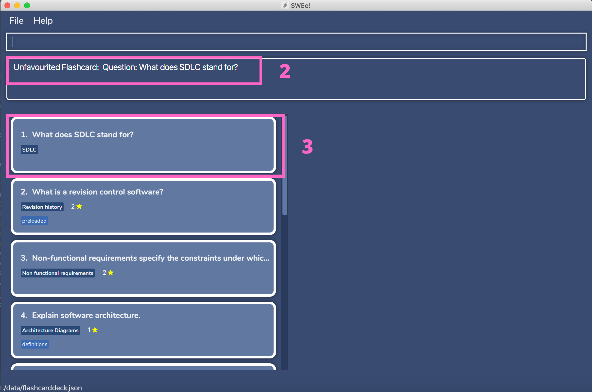

### Find flashcards : `find`

Want to find a particular flashcard but too lazy to check through all the flashcards individually to find it? We understand your struggles! Let SWEe! ease your pain by doing the finding for you! Keep your flashcards coming as we will provide an quick and easy way for you to search for anything and everything no matter how many flashcards you have.

Format: `find KEYWORD [KEYWORD]...`

* The keywords are **case insensitive**.

:memo: **Note**: If you search for multiple keywords, flashcards containing either of the keywords will be returned. For example, "General OOP" will return flashcards containing either General or OOP. 

:bulb: **Tip:** Want to list all your flashcards after using `find`? Use the [list](#list-all-flashcards--list) command.

 

Examples: 
* `find general` displays all flashcards containing the word general.
* `find general important` displays all flashcards containing either the word general or important.

**Steps for finding flashcards**:

**Step 1**: To find flashcards containing the keyword "SDLC", type `find SDLC` in the command box and press Enter.

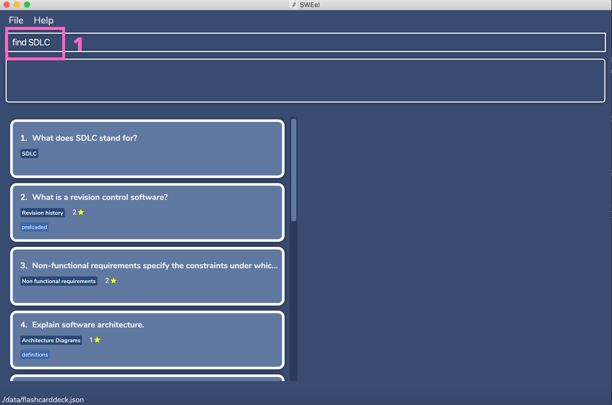

**Step 2**: SWEe! will let you know whether there were any flashcards matching the keyword(s) in the result display, similar to number 2 in the picture below.

**Step 3**: You can see the matching flashcards in the flashcard list, similar to number 3 in the picture below.

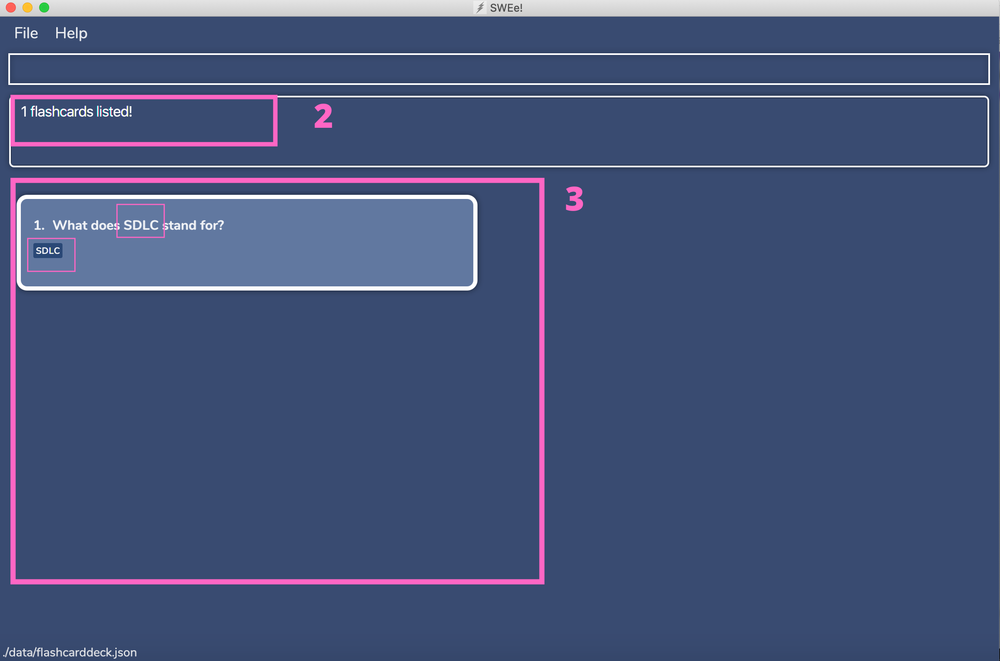

### View help : `help`

If you are unsure about some things in our app, you can use our help command which will direct you to our user guide.

Format: `help`

**Steps to use the help function**

**Step 1**: Type `help` in the command box and press Enter.

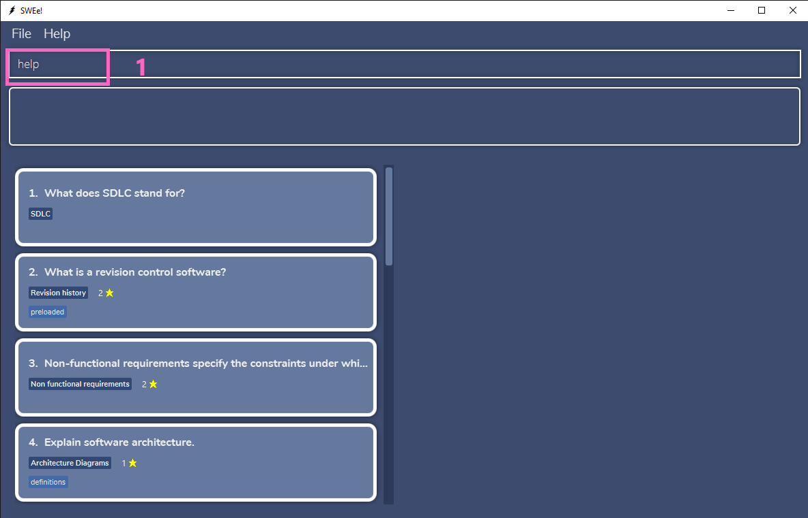

**Step 2**: A new window will pop out with a link.

**Step 3**: Simply click "Copy URL" then paste the link in your favourite browser, and you will be brought to our user guide website.

### List all flashcards : `list`

Want to see all of your flashcards? This is the command for you! 

:bulb: **Tip:** This command would be especially helpful in helping you to see your original list of flashcards after executing [filter](#filter-for-flashcards---filter) or [find](#find-flashcards--find) commands!

 

Format: `list`

**Steps for listing flashcards**:

**Step 1**: Type `list` in the command box and press Enter. 

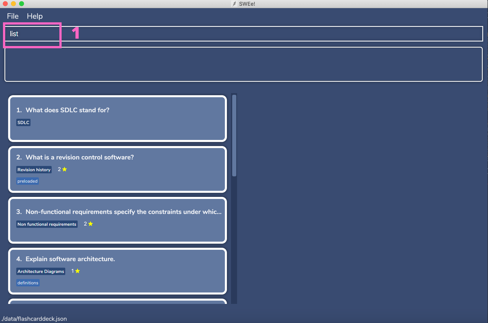

**Step 2**: The result display will display the message "Listed all flashcards".

**Step 3**: All the flashcards are now displayed in the scrollable flashcard list! Scroll down to see all of your flashcards!

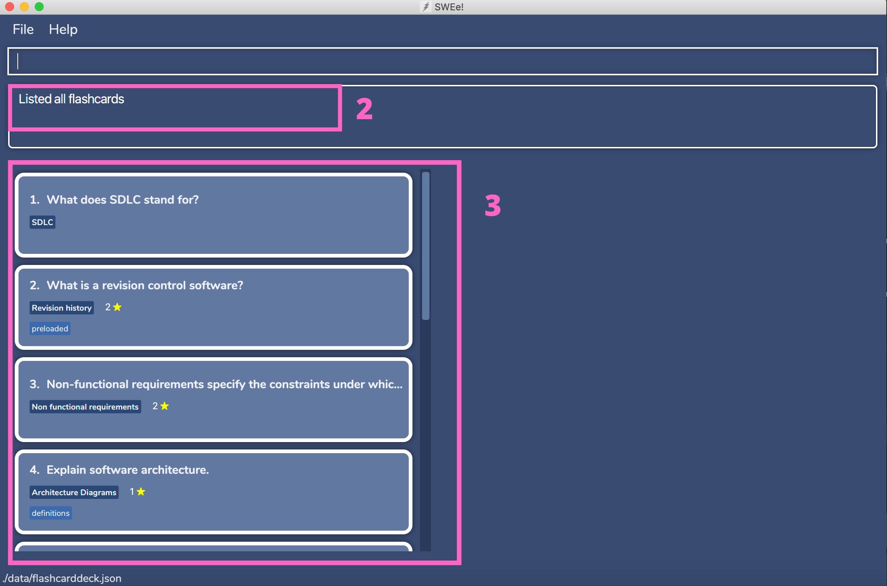

### Review flashcards: `review`

Want to study your flashcards? Our review mode lets you easily navigate freely between flashcards to study them so that you can ace your next exam!

Format: `review`

 

So what is review mode? Upon entering review mode, you can no longer input commands to the command box. However, the following keyboard input will now be recognised:

* `↓ key` shows the answer and notes of the current flashcard  
* `↑ key` hides the answer and notes of the current flashcard  
* `→ key` moves on to the next flashcard (if there is a next flashcard)
* `← key` moves to the previous flashcard (if there is a previous flashcard)
* `q` quits review mode

 

**Steps for entering review mode**:

**Step 1**: We want to enter review mode to review our flashcards. Type the command `review` and press Enter.

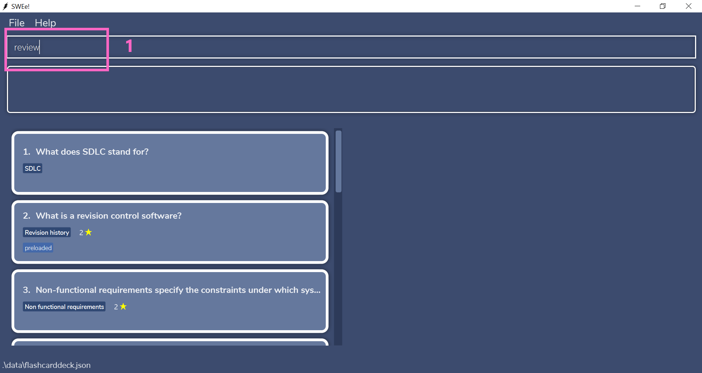

**Step 2**: We are brought into review mode. The instructions on how to navigate review mode will be shown at the top.

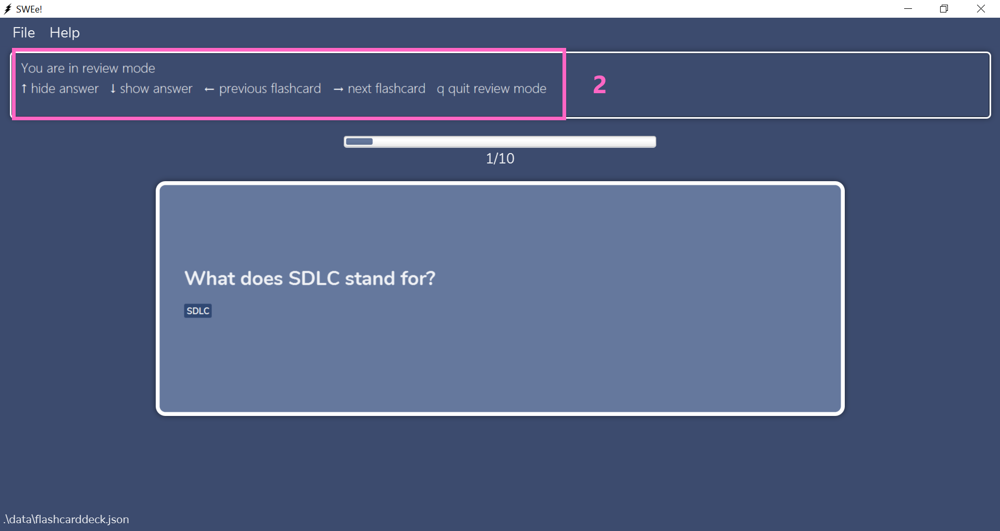

**Step 3**: In this example, we will demonstrate the behaviour of the `↓ key`. Upon pressing the `↓ key`, the answer of the flashcard is shown.

**Step 4**: Now, let's move onto the next flashcard. We just need to press the `→ key`

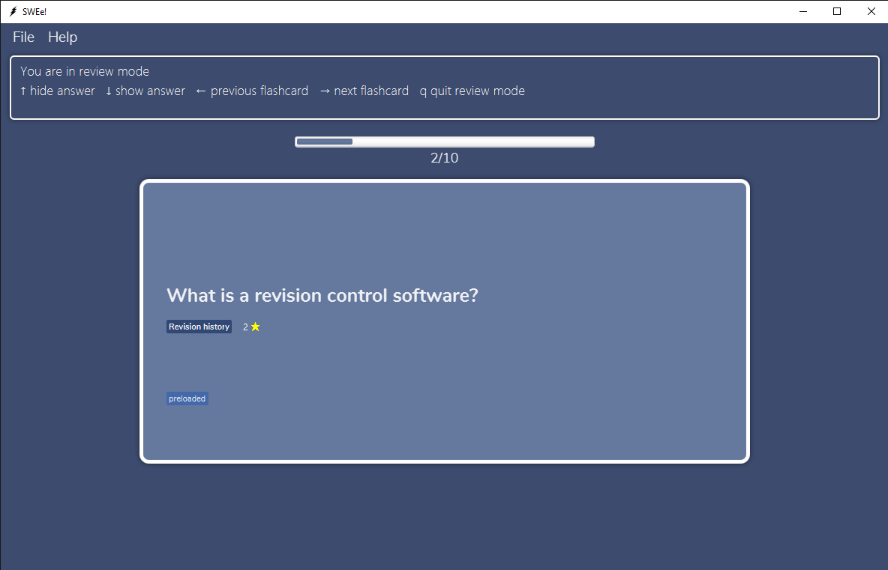

 

To summarise, when you are in review mode, use the `↓ key` and `↑ key` to toggle showing the flashcard’s answer and notes. Use the `→ key` and `← key` to move between flashcards. Use the `q key` to quit review mode.

### Quiz flashcards: `quiz`

Want to revise for your upcoming exam? Our quiz mode simulates a mock exam to put your knowledge to the test and monitors how well you score.

Format: `quiz`

So what is quiz mode? Upon entering quiz mode, you can no longer input commands to the command box. However, the following keyboard input will now be recognised:
* `↓ key` shows the answer and notes of the current flashcard  
* `q` quits quiz mode
* `y` This input will only be recognised after the `↓ key` is pressed. `y` indicate a correct quiz attempt. 
* `n` This input will only be recognised after the `↓ key` is pressed. `n` indicates an incorrect quiz attempt. 

Quiz attempts are recorded and information about your scores can be displayed using the [stats](#view-the-statistics-of-flashcard--stats) command.

**Steps for entering quiz mode**:

**Step 1**: We want to enter quiz mode to test ourselves on the current list of flashcards. Type the command `quiz` and press Enter.

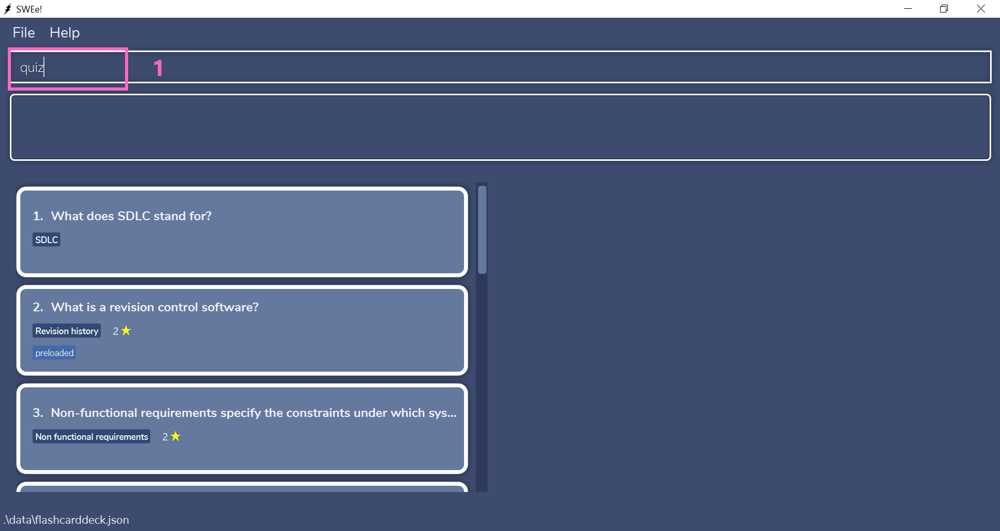

**Step 2**: We are brought into quiz mode. The instructions on how to navigate quiz mode will be shown at the top.

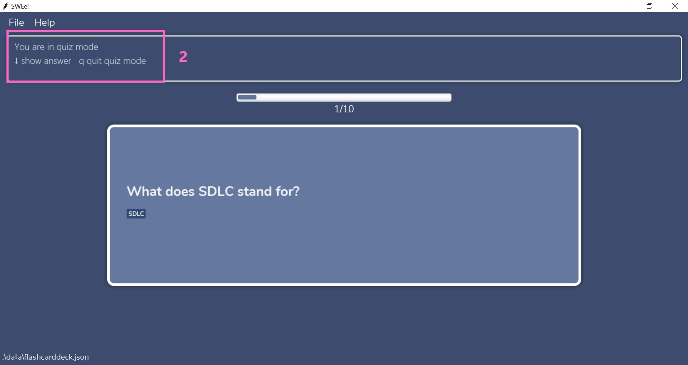

**Step 3**: Once we have come up with an answer for our flashcard, we simply click the `↓ key`. This will reveal the correct solution to the flashcard. A prompt will also appear at the top to check if we have answered the question correctly or incorrectly.

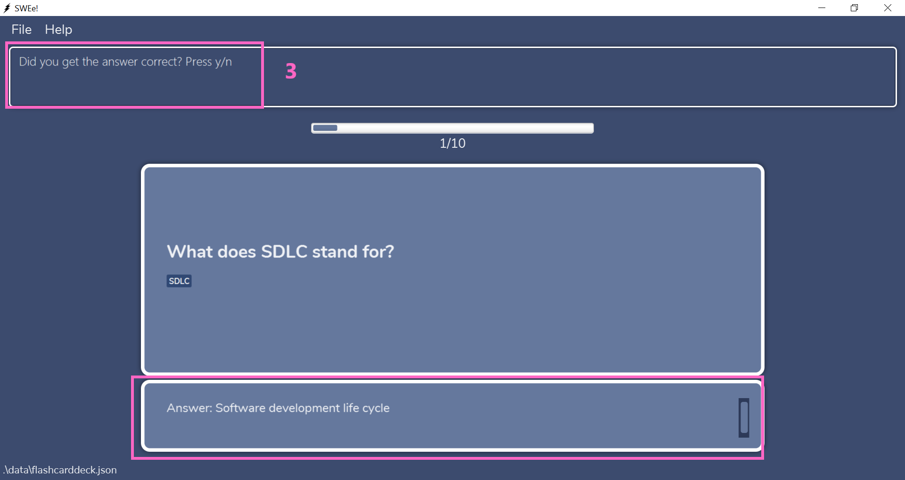

**Step 4**: We have gotten the correct answer, so we will press `y`. This will automatically bring us to the next flashcard.

### Sort all flashcards : `sort`

Want to get an overview of how skilled you are at answering the flashcards? Our sort command is here to help you, with two important criteria that you can sort your flashcards by, namely the quiz frequency and success rate of your flashcards!

Format: `sort <success|quiz> <-a|-d>`

* Specifying `-a` means sorting by the criteria in ascending order.
* Specifying `-d` means sorting by the criteria in descending order.

Examples: 
* `sort success -a` sorts the flashcards according to success rate in ascending order.
* `sort success -d` sorts the flashcards according to success rate in descending order.
* `sort quiz -a` sorts the flashcards according to quiz frequency in ascending order.
* `sort quiz -d` sorts the flashcards according to quiz frequency in descending order.

:bulb: **Tip:** If you are confused about what quiz frequency and success rate mean, head over to our [FAQ](#faq) section to understand it more!

 

**Steps for sorting flashcards**:

**Step 1**: In this example, we want to sort the flashcards according to success rate in an ascending order. Type `sort success -a` into the command box and press Enter.

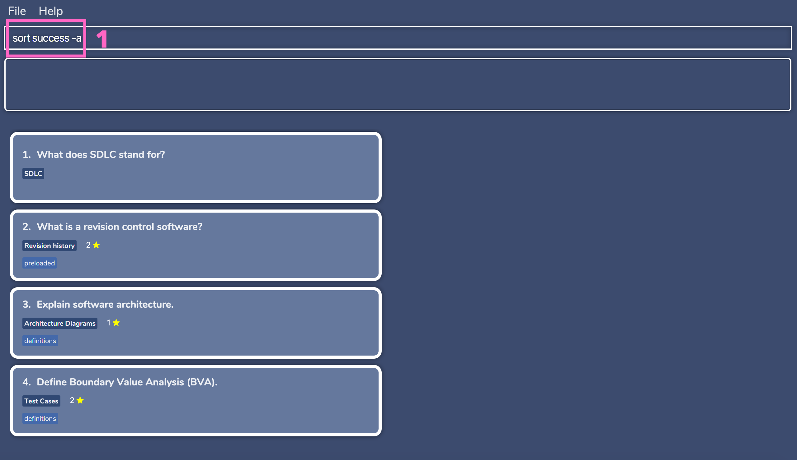

**Step 2**: The result display will show a message telling you that the flashcards have been sorted according to success rate in ascending order.

**Step 3**: The flashcard list will show the newly sorted list of flashcards according to the criteria.

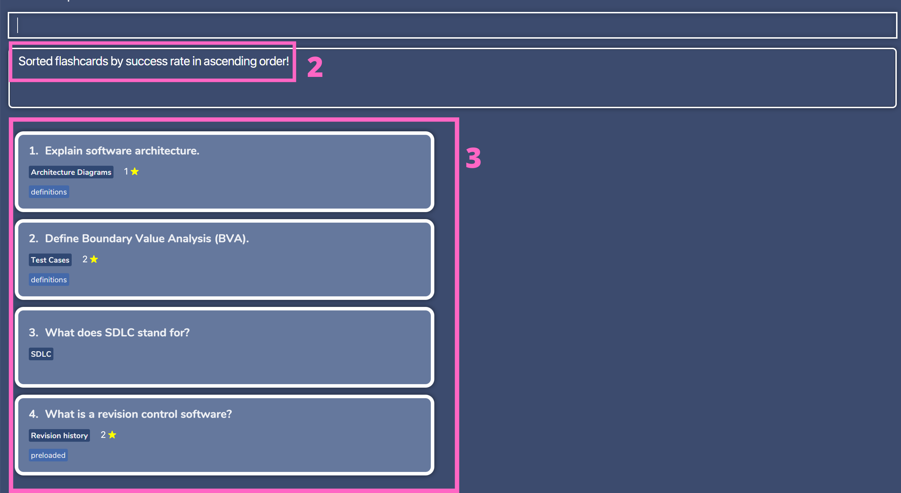

### View a flashcard  : `view`

The view command allows you to see your flashcards in detail. You will be able to see the full question on the flashcard and the diagram of the flashcard. Optionally, you can also choose to see the answer and notes of the flashcard.

Format: `view INDEX [-a]`

* If `-a` is specified, the answer and notes of the flashcard will be shown too.

Examples:
* `view 1` shows the flashcard at index 1 on the view pane **without** answer and notes.
* `view 1 -a` shows the flashcard at index 1 on the view pane **with** answer and notes.

 

**Steps for viewing a specific flashcard**:

**Step 1**: Locate the flashcard you wish to view. In this example, we want to view the flashcard at index 3. Type the command `view 3` and press Enter.

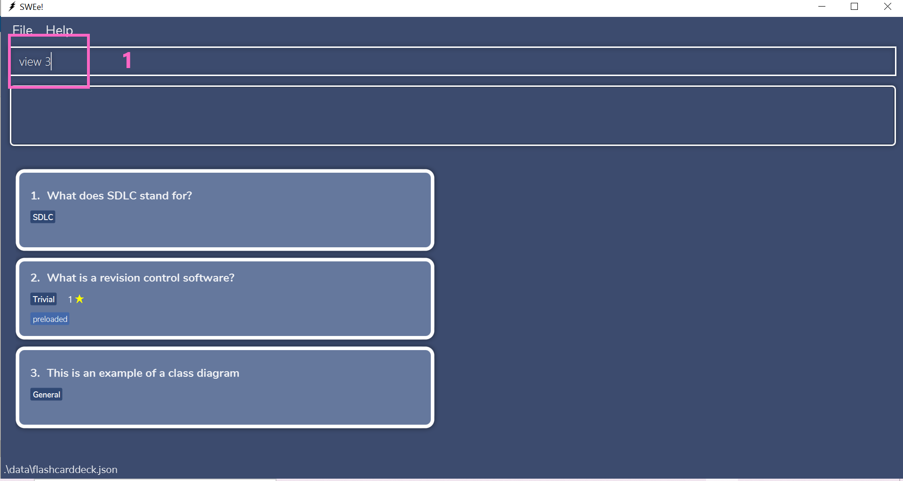

**Step 2**: We will be presented with a "snapshot" of the flashcard at index 3 in the view pane.

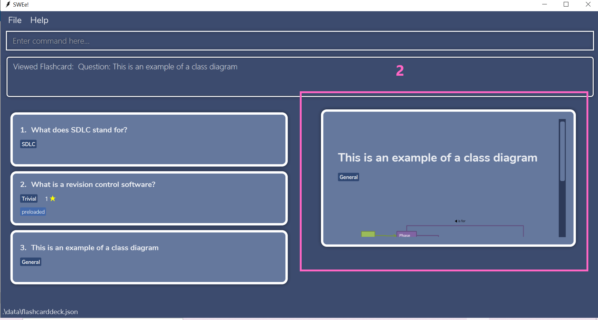

**Step 3**: Now let's say we also want to view the answer and notes of this flashcard. Type the command `view 3 -a` and press Enter.

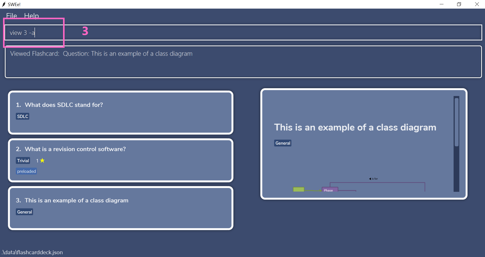

**Step 4**: The answer of the flashcard is displayed on the view pane as well.

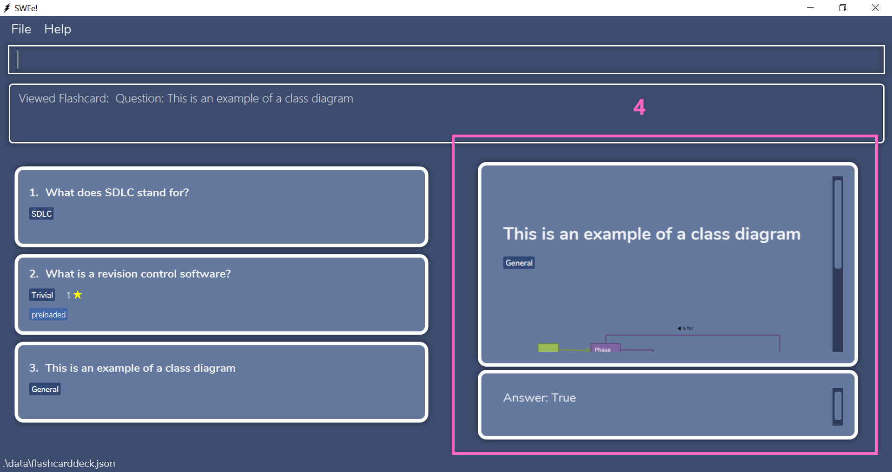

### View the statistics of flashcard : `stats`

Want to track your performance in quiz mode? The stats command simplifies your life by providing data visualisation of your results.

Format: `stats INDEX`

Example:
* `stats 1` shows the statistics of the 1st flashcard in the displayed flashcard list on the view pane.

Using the `stats` command will show the following information in the view pane:

* Pie chart. This chart shows the percentage of correct attempts versus incorrect attempts.
* Total quiz attempts. This numerical value represents the total number of attempts in quiz mode.
* Correct attempts. This numerical value represents the total number of correct attempts in quiz mode.

An example is shown below: 

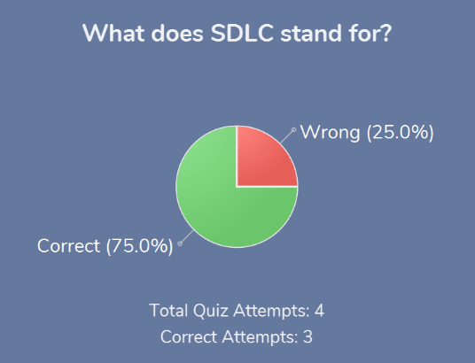

 

**Steps for viewing the statistics of a specific flashcard**:

**Step 1**: Locate the flashcard you wish to view the statistics of. In this example, we want to view the statistics of the flashcard at index 1. Type the command `stats 1` and press Enter.

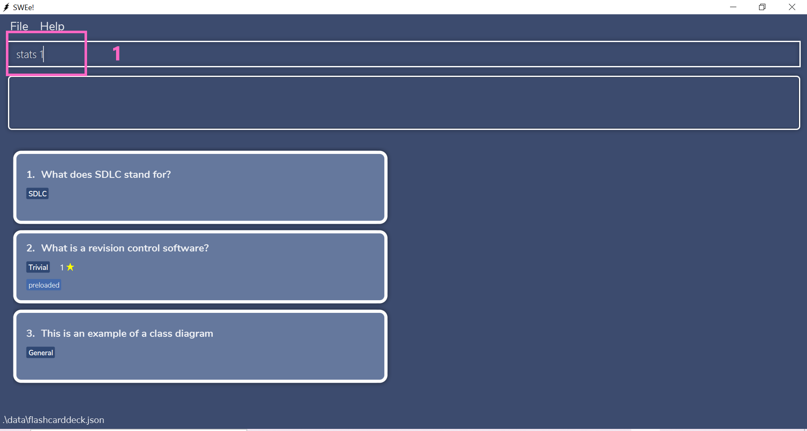

**Step 2**: The statistics of the flashcard at index 1 will be displayed in the view pane.

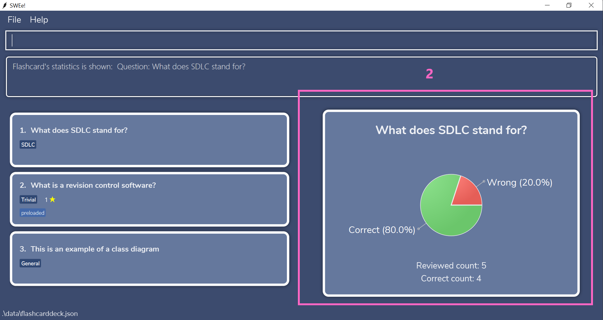

### Exit the application : `exit`

Need a coffee break? You can exit from SWEe! using the following command.

Format: `exit`

**Steps to exit the application**:

**Step 1**: Type `exit` in the command box and press Enter. The application will close and we look forward to seeing you back 😊 .

### Saving the data

Worried that all the precious flashcards you have saved would be gone after closing the app? Do not worry! Feel free to close the app anytime in peace! Flashcards data are saved in the hard disk automatically for you after any command that changes the data. There is no need to save manually.

--------------------------------------------------------------------------------------------------------------------

## FAQ

**Q**: Help! I can't open the app by double-clicking the jar file?  
**A**: Don't worry! Follow the steps below to open the app!  

* **Step 1:** Fire up your terminal and navigate to the *home folder* where the Jar file is located!  

* **Step 2:** Type in the command `java -jar swee.jar` and the app should start in a few seconds!

**Q**: Why is there data which I did not include when I first start SWEe!? 
**A**: We understand that you are a new user! SWEe! therefore provides you with some sample data to experiment first before you start using SWEe! proper. Hope that you will enjoy using SWEe!.

**Q**: What is the difference between review mode and quiz mode? 
**A**: Review mode is like a sandbox mode where you can move back and forth between flashcards. In quiz mode, you can only go forward. Also, quiz mode asks you for feedback and keeps track of statistics but review mode doesn't.

**Q**: What is the quiz frequency of a flashcard? 
**A**: It is just the total number of quiz attempts for the flashcard! (refer to [Quiz](#quiz-flashcards-quiz)).

**Q**: What is the success frequency of a flashcard? 
**A**: It is just the number of **correct** quiz attempts for the flashcard! (refer to [Quiz](#quiz-flashcards-quiz)).

**Q**: What is the success rate of a flashcard? 
**A**: Success rate of a flashcard is measured by `(success frequency) / (quiz frequency) x 100%`. If a flashcard has a quiz frequency of 0, then its success rate will be 0%.

**Q**: How do I save my progress after executing commands? 
**A**: SWEe! does an auto save every time you exit the app and automatically loads the latest state of flashcards when you relaunch the app. 

**Q**: Is there a feedback channel for me to report bugs or provide any feedback?  
**A**: You can send your feedback to our team via email at cs2103_swee@gmail.com. Any feedback is appreciated and we will use it to improve SWEe!. Thank you!

--------------------------------------------------------------------------------------------------------------------

## Command Summary

Action | Format, Examples
--------|------------------
**Add** | `add q/QUESTION a/ANSWER [c/CATEGORY] [n/NOTE] [r/RATING] [d/DIAGRAM] [t/TAG]...`   eg. `add q/What does OOP stand for? a/Object Oriented Programming c/General n/Important question! d/images/diagram.jpeg`
**Clear** | `clear`
**Delete** | `delete INDEX`   eg. `delete 3`
**Edit** | `edit INDEX [q/QUESTION] [a/ANSWER] [c/CATEGORY] [n/NOTE] [r/RATING] [d/DIAGRAM] [t/TAG]...`   eg. `edit 3 q/What does OOP stand for? a/Object Oriented Programming`
**Filter** | <code>filter [c/CATEGORY] [r/RATING] [f/<yes&#124;no>] [t/TAG]...</code>   eg. `filter t/examinable r/3`
**Fav** | `fav INDEX`   eg. `fav 1`
**Unfav** | `unfav INDEX`   eg. `unfav 1`
**Find** | `find KEYWORD [KEYWORD]...`    eg. `find general important`
**Help** | `help`
**List** | `list`
**Review** | `review`
**Quiz** | `quiz`
**Sort** | <code>sort <success&#124;quiz> <-a&#124;-d></code>   eg. `sort success -a`
**View** | `view INDEX [-a]`   eg. `view 1`
**Stats** | `stats INDEX`   eg. `stats 3`
**Exit** | `exit`

## Appendix

### Finding file path for Diagram field
This short tutorial will be useful when adding or editing diagrams to flashcards.

**Step 1**: Locate the root folder containing the SWEe Jar file and navigate to it

 

**Step 2**: Next, locate the relative file path of the image file. In this example, our diagram is located in the image folder.
Hence, the relative file path is `image/classDiagramExample1.png` 

**Step 3**: Now, go ahead and add or edit your flashcard by adding `d/image/classDiagramExample1.png` after the appropriate command!

Examples of usages of the diagram field:
* `add q/Is this a class diagram? a/Yes d/image/classDiagramExample1.png`
*  `edit 1 d/image/classDiagramExample1.png`

Navigate back to [adding a flashcard](#add-a-flashcard--add) or navigate back to [editing a flashcard](#edit-a-flashcard---edit)

### Contributions

#### Kimberly Ong

- [Quick Start](#quick-start)
- [Find flashcards](#find-flashcards--find)
- [Favourite a flashcard](#favourite-a-flashcard---fav)
- [Unfavourite a flashcard](#unfavourite-a-flashcard---unfav)
- [List all flashcards](#list-all-flashcards--list)
- [Saving the data](#saving-the-data)
- FAQ Q1 & Q2

#### Ong Si Min

- [Notes about the command format](#notes-about-the-command-format)
- [Delete a flashcard](#delete-a-flashcard---delete)
- [Edit a flashcard](#edit-a-flashcard---edit)
- [Sort all flashcards](#sort-all-flashcards--sort)
- FAQ Q8

#### Ong Yi Jie Melvin

- [Introduction](#introduction)
- [Quiz flashcards](#quiz-flashcards-quiz)
- [View the statistics of a flashcard](#view-the-statistics-of-flashcard--stats)
- [Exit the application](#exit-the-application--exit)

#### Tan Zhuo Yao
- [Application Layout](#application-layout)
- [Add a flashcard](#add-a-flashcard--add)
- [Clear all flashcards](#clear-all-flashcards--clear)
- [Filter for flashcards](#filter-for-flashcards---filter)
- [Finding file path for Diagram field](#finding-file-path-for-diagram-field)
- FAQ Q7

#### Ng Song Guan
- [Common Input Fields](#common-input-fields)
- [View help](#view-help--help)
- [Review flashcards](#review-flashcards-review)
- [View a flashcard](#view-a-flashcard---view)
- FAQ Q3, Q4, Q5, Q6

### Website Link

https://ay2021s1-cs2103t-t17-2.github.io/cs2101ug/UserGuide.html